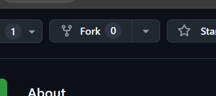
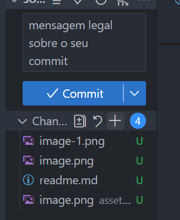
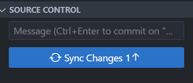

# Iae jovem

## Missões

1. Crie um fork do projeto



2. Clone o projeto

em seu terminal
```
git clone https://github.com/LpxsBr/resolveAi.git
```

3. Navegue até o projeto

em seu terminal:

```bash
cd resolveAi
```

4. Crie uma branch para você:

em seu terminal

```bash
git checkout -b minha_branch
```

5 - Abra o VSCode (pelo terminal para ficar emocionante)

em seu terminal
```
code .
```

6 - Conclua a ativdade dentro do index.html

7 - Commit

em seu terminal:

```bash
git commit -m "mensagem legal sobre o commit"
```

ou




8 - dê push


```bash
git push -u origin minha_branch
```

ou



9 - vá até o vscode e clique em contribuir no canto superior direito e abra o pull request :)